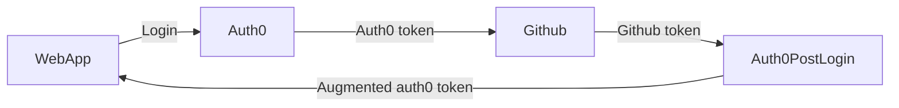

# Auth0



```js
/* eslint-disable @typescript-eslint/explicit-function-return-type */

/**
* Handler that will be called during the execution of a PostLogin flow.
*
* @param {Event} event - Details about the user and the context in which they are logging in.
* @param {PostLoginAPI} api - Interface whose methods can be used to change the behavior of the login.
*/
exports.onExecutePostLogin = async (event, api) => {

  if (event.connection.name !== 'github') return

  const fetch = require('node-fetch')
  const auth0Domain = 'https://shuunen.eu.auth0.com'
  const auth0Audience = `${auth0Domain}/api/v2/`

  // For more information about how to use Auth0 APIs
  // Authentication API (public) : https://auth0.com/docs/api/authentication
  // Management API (private): https://auth0.com/docs/api/management/v2/
  // Get access token : https://auth0.com/docs/api/authentication#client-credentials-flow
  const getAuth0Token = async () => {
    const payload = {
      grant_type: 'client_credentials',
      client_id: event.secrets.CLIENT_ID,
      client_secret: event.secrets.CLIENT_SECRET,
      audience: auth0Audience,
    }
    const body = JSON.stringify(payload)
    const options = { method: 'POST', headers: { 'Content-Type': 'application/json' }, body }
    const response = await fetch(`${auth0Domain}/oauth/token`, options)
    const data = await response.json()
    return data.access_token
  }

  // Retrieve the complete user profile which contains the Github access token
  // Use the previous Auth0 access token : https://auth0.com/docs/api/management/v2/#!/Users/get_users_by_id
  const getGithubToken = async (/** @type {string} */ auth0Token) => {
    const options = { headers: { Authorization: `Bearer ${auth0Token}` } }
    const response = await fetch(`${auth0Audience}users/${event.user.user_id}`, options)
    const data = await response.json()
    if (!data.identities) return 'no_data_identities'
    console.log('identities', data.identities)
    return data.identities[0].access_token
  }

  const auth0Token = await getAuth0Token()
  const githubToken = await getGithubToken(auth0Token)
  // Add the custom claim into the ID token : https://auth0.com/docs/customize/actions/flows-and-triggers/login-flow#add-user-roles-to-id-and-access-tokens
  // api.idToken.setCustomClaim('custom_name', 'John Doe')
  // api.accessToken.setCustomClaim('custom_name', 'John Doe')
  api.idToken.setCustomClaim('custom_github_token', String(githubToken))
  api.idToken.setCustomClaim('custom_connection_name', event.connection.name)
}

/**
* Handler that will be invoked when this action is resuming after an external redirect. If your
* onExecutePostLogin function does not perform a redirect, this function can be safely ignored.
*
* @param {Event} event - Details about the user and the context in which they are logging in.
* @param {PostLoginAPI} api - Interface whose methods can be used to change the behavior of the login.
*/
// exports.onContinuePostLogin = async (event, api) => {
// };
```
